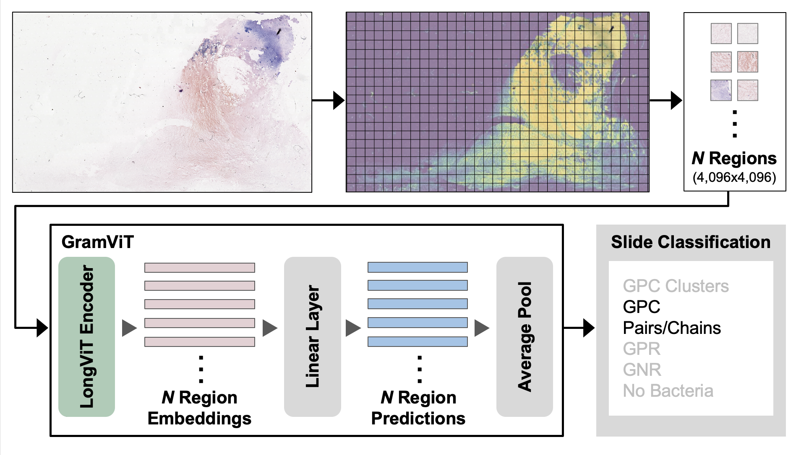

# GramViT 

The repo contains the trained model and code for the paper, [A Novel Framework for the Automated Characterization of Gram Stained Blood Culture Slides Using a Large Scale Vision Transformer](https://pages.github.com/). GramViT is a region-sampling framework for characterizing Gram-stained slides using Microsoft's LongViT vision Transformer model.

Our model was trained to characterize five common categories of Gram-stained WSIs: Gram-positive cocci in clusters, Gram-positive cocci in pairs/chains, Gram-positive rods, Gram-negative rods, and slides with no bacteria. It was trained using a 475-slide dataset of blood culture Gram-stained slides collected at Dartmouth Hitchcock Medical Center (Lebanon, New Hampshire, USA).

## Dependencies

See requirements.txt

## Usage

In order to use this repository, you need to create a cvs file for your dataset containing dataset metadata and file paths.

1: Extract regions from each svs file

    python preprocessing/1_get_regions.py --csv_file_path --output_folder --region_size

2: Build Dataset Index

    python preprocessing/2_create_index.py --index_path --pickle_split_path --total_fold

3: Train Model 

    bash code/launch_finetuning_gs.py

4: Evaluate Model

    bash code/launch_evaluate_gs_finetune.py
